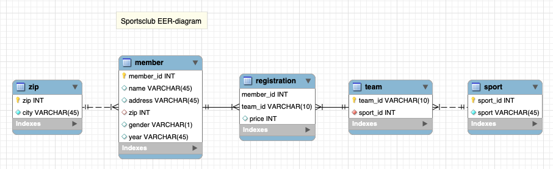

# Sportsclub database java application

This piece of code is an example on how to apply CRUD operations on
a Postgres database from Java through jdbc.

The code is written for 2. semester on the Datamatiker education in Lyngby.

The code is NOT refactored.

## Adding an integration test


## Exercises

These exercises are aimed at adding integration tests to the 
sportsclub application. The purpose is to test the datamapper methods, so
that we can make sure that our database queries are working.

### Get started - setting up for integration tests

1) Begin by cloning the project. Since todays project is hiding on a branch called
   "integrationtest", you need to clone the specific branch like this: 
   - `git clone -b integrationtest https://github.com/dat2Cph/dat2-sportsclub.git` or with SSH:
   - `git clone -b integrationtest git@github.com:dat2Cph/dat2-sportsclub.git`
   
2) After cloning, remove the .git folder by typing `rm -rf .git`.
3) Open the project in IntelliJ
4) We assume that you already have the sportsclub database in your Postgres. 
   Otherwise, create the database 'sportsclub', open the file "src/main/resources/sportsclub.sql" in pgAdmin 
   and execute it to create the sportsclub tables and data.
5) Update the login credentials in the "Main class" to reflect your local system. It should be okay alreade, but be sure.
6) Inside the `sportsclub` database, create a new schema in PgAdmin called "test". The
7) Update the login credentials in the MemberMapperTest.java file if needed. Notice how the jdbc url is pointing to the test schema.
8) Run Main and the tests, and get to know the code.

### Getting to know the MemberMapperTest.java file

9) Try to describe in your own word what happens in the @BeforeAll section. We suggest
   that you write a comment at the end of each line.
10) Try also to describe what happens in the @BeforeEach section by commenting the code.
11) Investigate each of the tests below, write your own comments,
    and try to change the test to make them fail:
    - testConnection()
    - getAllMembers()
    - getMemberById()
    - deleteMember()
    - insertMember()
    - updateMember()
12) Create a new test in which you will try to delete two members
    and find out if it went well.
13) Create a new test in which you will delete a member with a 
    member_id that does not exist. It could be member_id = 1234. Try
    to figure out how to test it correctly. For this
    to work, you will need to use assertThrows and take a close
    look at the exceptionhandling in the deleteMember method.
    Hint: Try this version:

    ```java
    @Test
    void deleteMemberUnknownId() throws DatabaseException {
        assertThrows(DatabaseException.class, () -> memberMapper.deleteMember(12312));
    } 
    ```
14) Create a test in which you will try to insert a new member
    with illegal types. It could be that you try to insert a 
    member with an illegal gender type. "x" for example. For this
    to work, you will need to use assertThrows. 
    

### Adding a brand new xxxMapperTest

15) Yesterday we worked on adding a RegistrationMapper to the
    application in the exercises. In case you have made it, then
    add a new test class and test the mapper.

### The EER diagram


